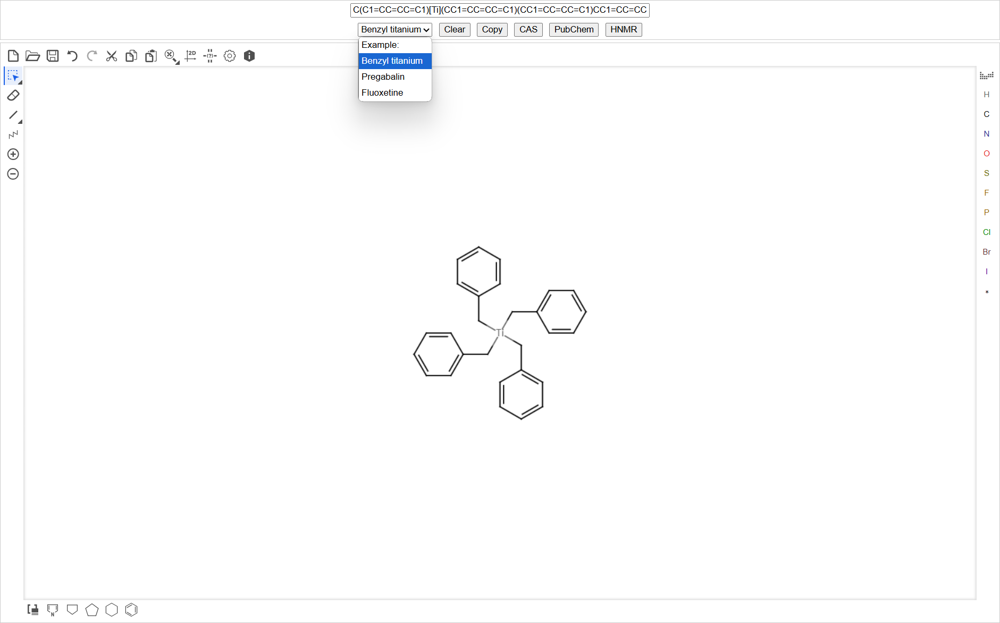
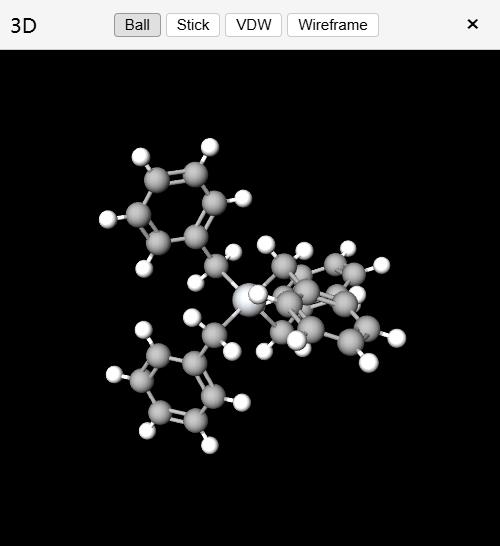
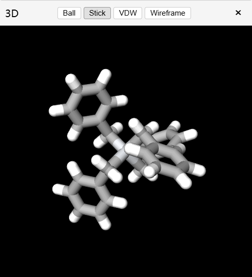
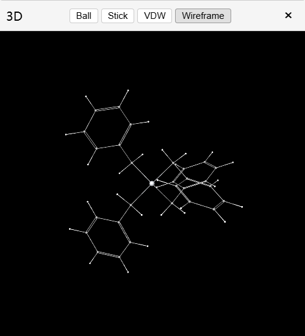

# 功能

- smiles与结构式互相转换
- PubChem搜索
- HNMR搜索
- Example:
    - Benzyl titanium
    - Pregabalin
    - Fluoxetine
- 获取CAS
- 3D可视化
    - 可移动窗口
    - 可与结构式，smiles进行实时更新
    - 种类
        |  |  |  |  |
        |---|---|---|---|