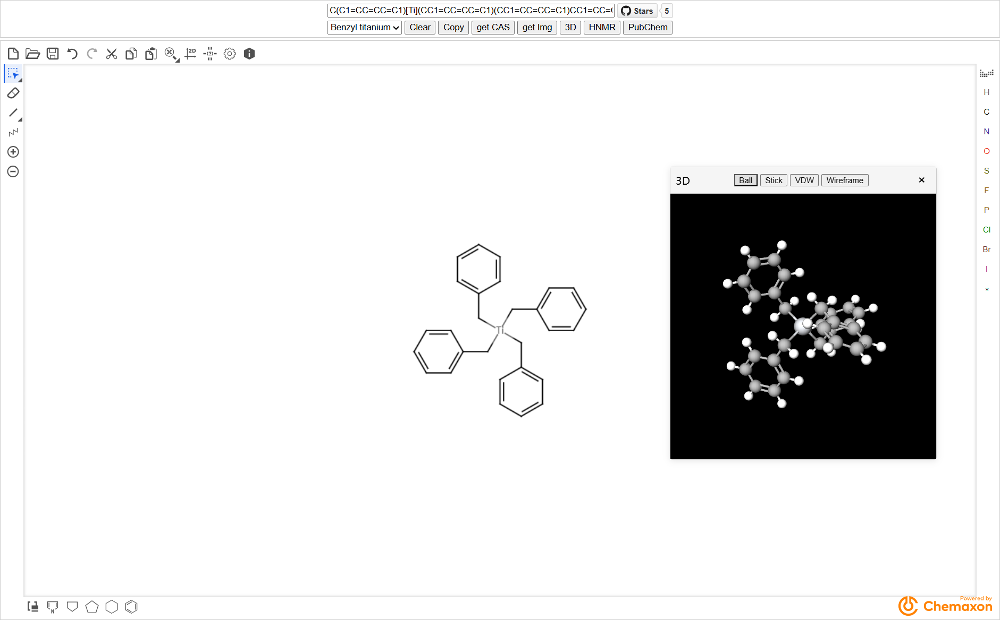

# Marvin JS

Powered by [Chemaxon](https://chemaxon.com)

## 依赖

- [pubchem](https://pubchem.ncbi.nlm.nih.gov)
- [nmrdb](https://www.nmrdb.org)
- [molview](https://molview.org)

## 预览

## 功能

- smiles与结构式互相转换
- PubChem搜索
- HNMR搜索
- Example:
    - Benzyl titanium
    - Pregabalin
    - Fluoxetine
- 获取CAS
- 获取img
- 3D可视化
    - 可与结构式，smiles进行实时更新
    - 种类
        |  |  |  |  |
        |---|---|---|---|