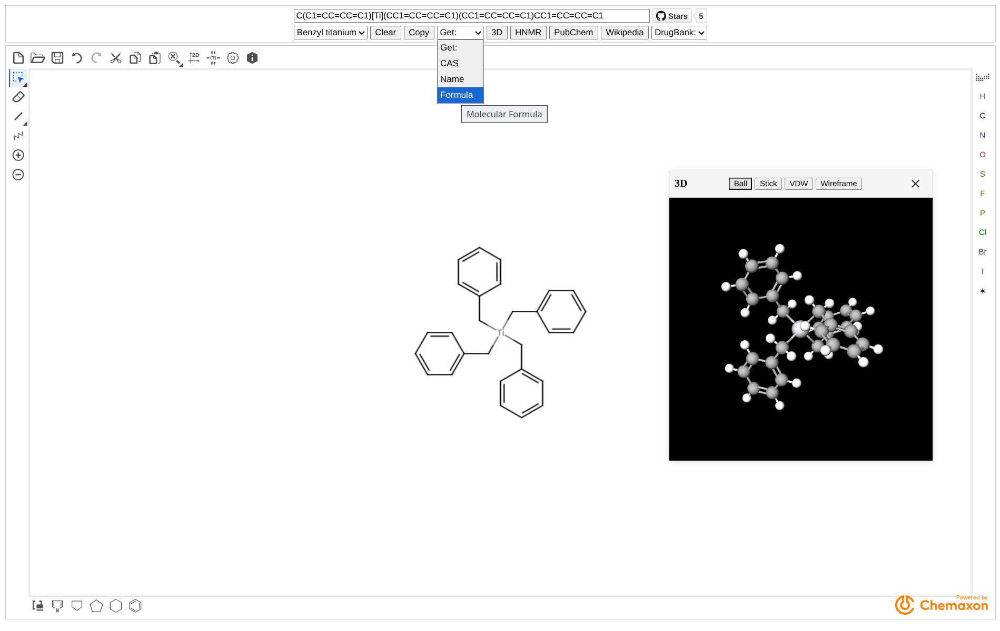

# StructuredSearch

    简体中文 | <a href="README_en.md">English</a>

基于Marvin JS分子草图面板和网络服务的从分子结构搜索化合物信息

Powered by [Chemaxon](https://chemaxon.com)

## 依赖

- [pubchem](https://pubchem.ncbi.nlm.nih.gov)
- [nmrdb](https://www.nmrdb.org)
- [molview](https://molview.org)

> [!tip]
> DrugBank exact和Wikipedia跳转链接来自PubChem JSON

- [drugbank](https://go.drugbank.com)
- [wikipedia](https://en.wikipedia.org)

## 预览

## 功能

- smiles与结构式互相转换
- 支持smiles通过URL传入 https://structuredsearch.pages.dev/?smiles=C1=CC=CC=C1
- Example:
    - Benzyl titanium (苄钛)
    - Pregabalin (普瑞巴林)
    - Fluoxetine (氟西汀)
- Clear
- Copy
- Get:
    - CAS
    - (IUPAC)Name
        - 当pubchem数据库中存在该化合物则直接获取
        - 当pubchem数据库中不存在该化合物则通过marvinjs的命名服务获取
    - Molecular Formula (分子式)
    - Compound Link https://structuredsearch.pages.dev/?smiles=C1%3DCC%3DCC%3DC1
- 3D可视化
    - 可与结构式，smiles进行实时更新
    - 种类
        |  |  |  |  |
        |---|---|---|---|
- HNMR搜索
- PubChem搜索
- Wikipedia搜索
- DrugBank搜索
    - exact (详细)
    - fuzzy (模糊)

## 更多

- [KetcherSearch](https://github.com/biantailab/KetcherSearch) - 基于Ketcher的纯前端实现smiles⇄mol的从分子结构中搜索化合物信息