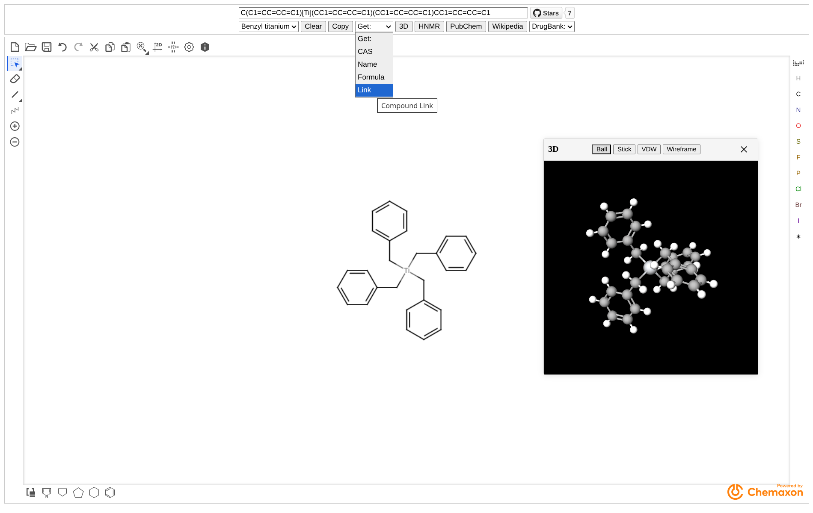
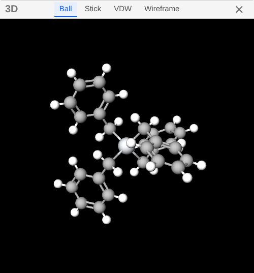
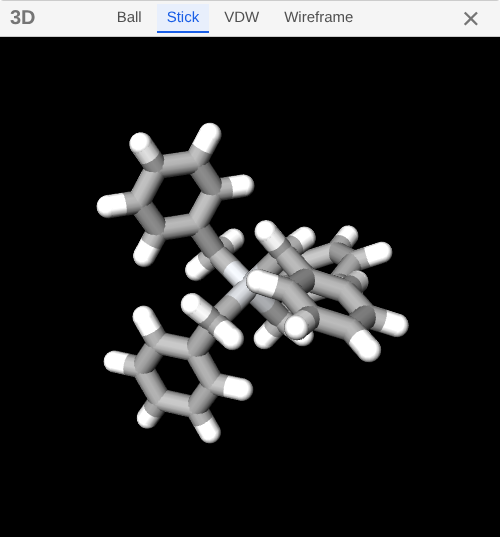
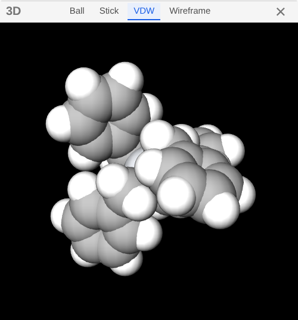
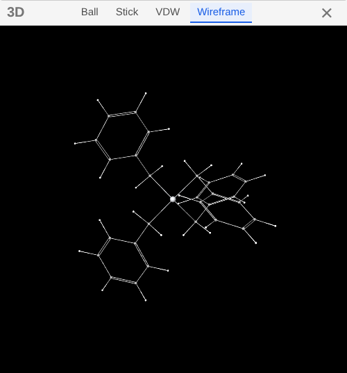

# StructuredSearch

    <a href="README.md">简体中文</a> | English

Searching compound information from molecular structures using the Marvin JS molecular sketch panel and webservices

Powered by [Chemaxon](https://chemaxon.com)

## Dependencies

- [pubchem](https://pubchem.ncbi.nlm.nih.gov)
- [nmrdb](https://www.nmrdb.org)
- [molview](https://molview.org)

> [!tip]
> DrugBank exact and Wikipedia jump links from PubChem JSON

- [drugbank](https://go.drugbank.com)
- [wikipedia](https://en.wikipedia.org)

## Demo

## Functionality

- Real-time conversion of smiles and mol
- Example:
    - Benzyl titanium
    - Pregabalin
    - Fluoxetine
- Clear smiles
- Copy smiles
- Get:
    - CAS
    - IUPACName
        - If the compound exists in the PubChem database, it is acquire directly
        - If the compound does not exist in the PubChem database, it is obtained through MarvinJS's naming service
    - Molecular Formula
- 3D visualization
    - supports real-time updates with mol and smiles
    - types
        |  |  |  |  |
        |---|---|---|---|
- HNMR search
- PubChem search
- Wikipedia search
- DrugBank search
    - exact
    - fuzzy

## More

- [KetcherSearch](https://github.com/biantailab/KetcherSearch) - Pure front-end implementation of smiles⇄mol based on Ketcher Searching for compound information from molecular structures
