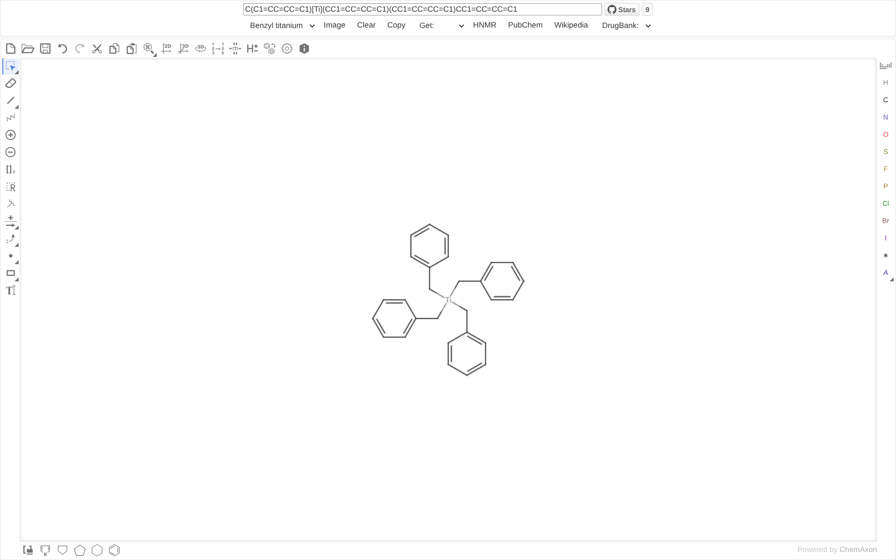

# StructuredSearch

    <a href="README.md">简体中文</a> | English

Searching compound information from molecular structures using the Marvin JS molecular sketch panel and webservices

Powered by [Chemaxon](https://chemaxon.com)

## Dependencies

- Data source
    - [pubchem](https://pubchem.ncbi.nlm.nih.gov)
- Molecular image recognition
    - [molscribe](https://huggingface.co/spaces/yujieq/MolScribe)
- Short link service
    - [cloudflare](https://www.cloudflare.com)
    - [netlify](https://netlify.com) + [neon](https://neon.com) 

## Search target

> [!tip]
> DrugBank exact and Wikipedia jump links from PubChem JSON

- [nmrdb](https://www.nmrdb.org)
- [pubchem](https://pubchem.ncbi.nlm.nih.gov)
- [wikipedia](https://en.wikipedia.org)
- [drugbank](https://go.drugbank.com)

## Demo

## Functionality

- Real-time conversion of SMILES and mol
- URL input
    - SMILES https://structuredsearch.pages.dev/?smiles=CCCCCCCCC=O
    - CAS https://structuredsearch.pages.dev/?cas=124-19-6
- `Example:`
    - `Benzyl titanium`
    - `Quinine`
    - `Norfloxacin`
- `Image` Convert molecular images to SMILES
- `Clear`
- `Copy`
- `Get:`
    - `CAS`
    - `Name` IUPACName
        - If the compound exists in the PubChem database, it is acquire directly
        - If the compound does not exist in the PubChem database, it is obtained through Marvin JS's naming service
    - `Formula` Molecular Formula
    - `Link` Short SMILES Link
    - `CAS Link`
- `HNMR`
- `PubChem`
- `Wikipedia`
- `DrugBank`
    - `exact`
    - `fuzzy` Fuzzy, structural and similar search

## Other versions

- Version based on external web services [cloudflare pages](https://structuresearch.pages.dev) / [netlify pages](https://structuresearch.netlify.app)
- Version based on internal web services [cloudflare pages](https://structursearch.pages.dev) / [netlify pages](https://structursearch.netlify.app)

## More

- [KetcherSearch](https://github.com/biantailab/KetcherSearch) - Pure front-end implementation of SMILES⇄mol based on Ketcher Searching for compound information from molecular structures
